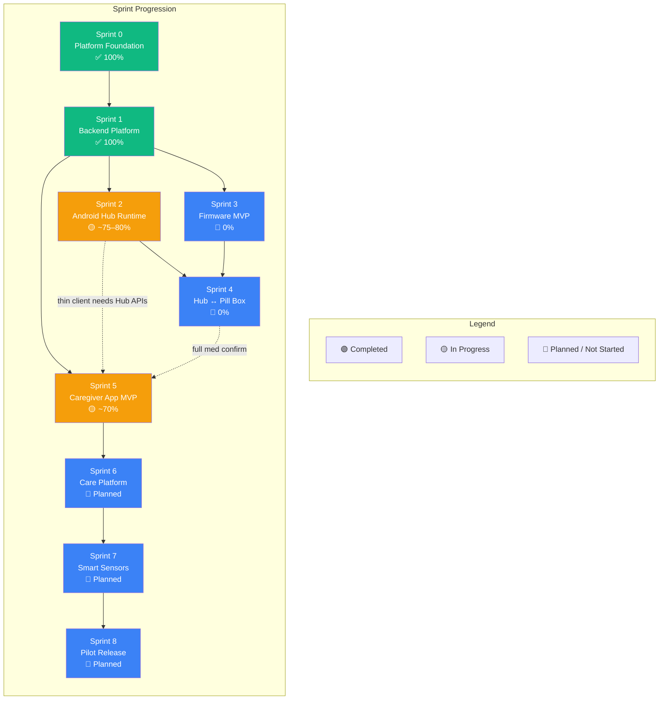
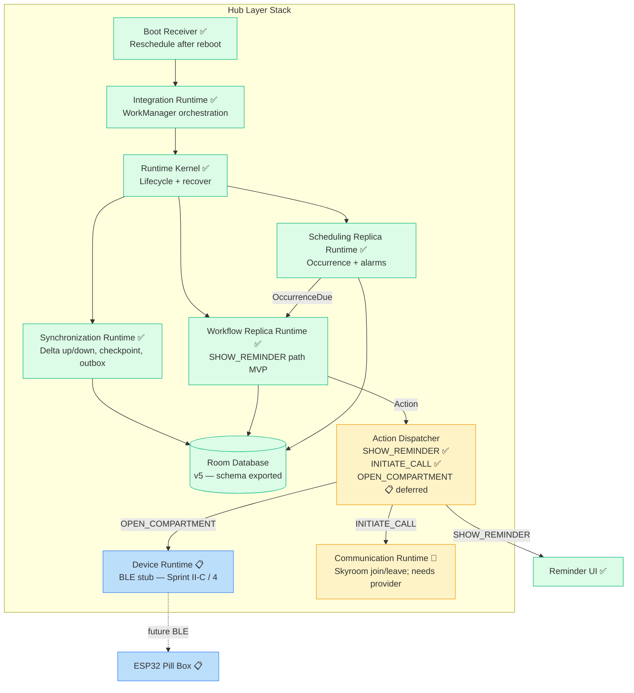
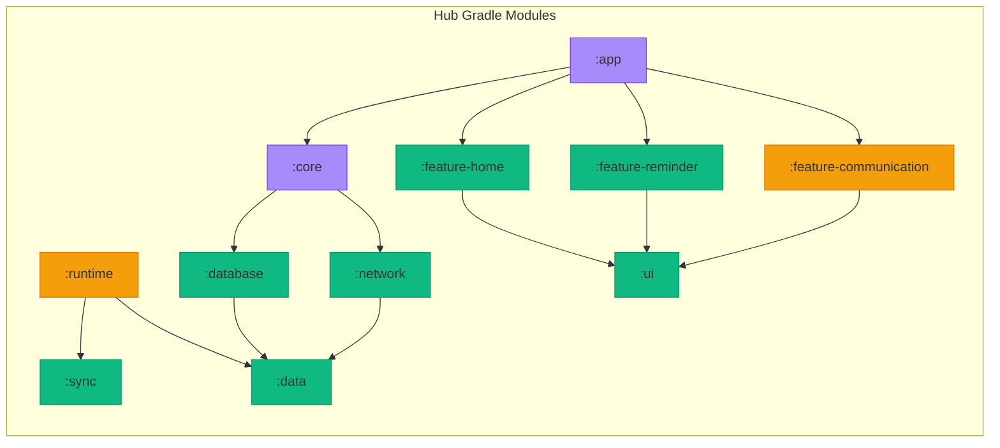
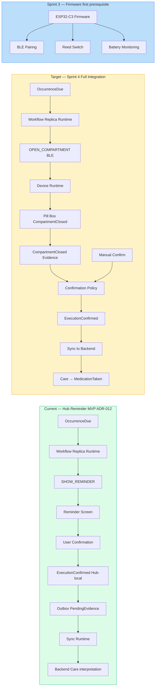
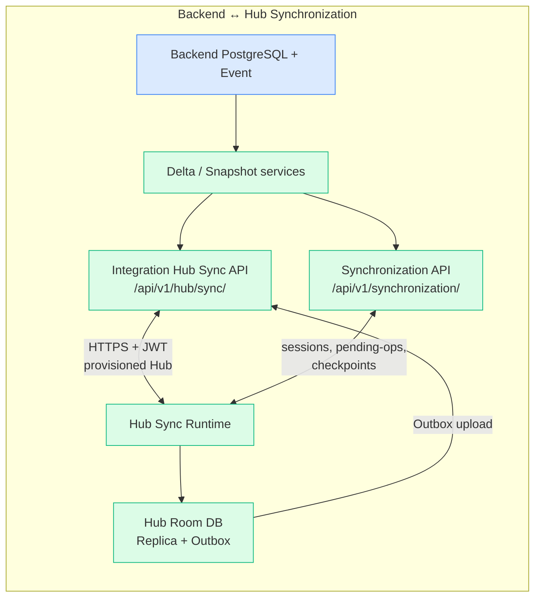
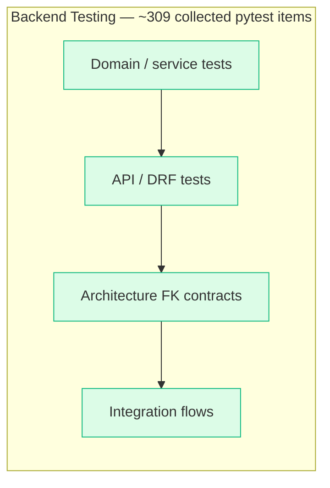
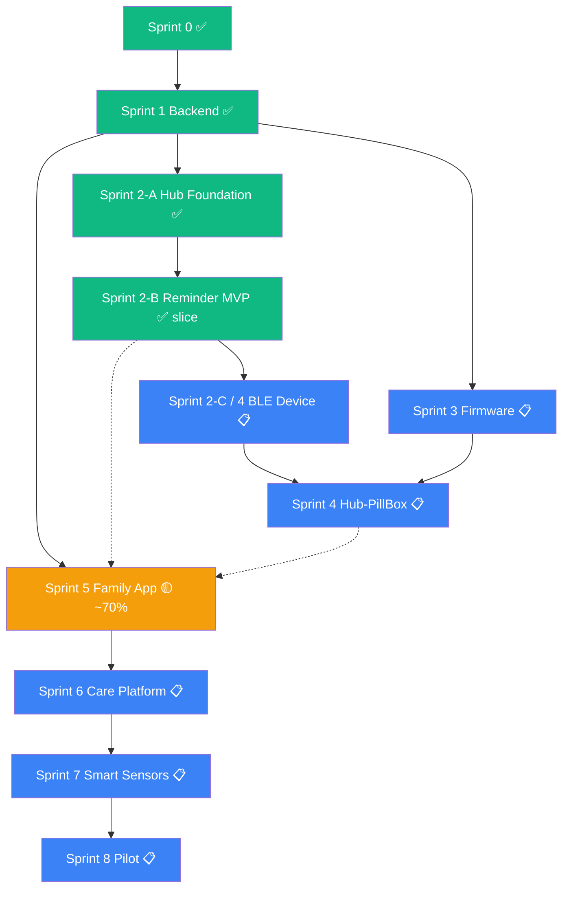
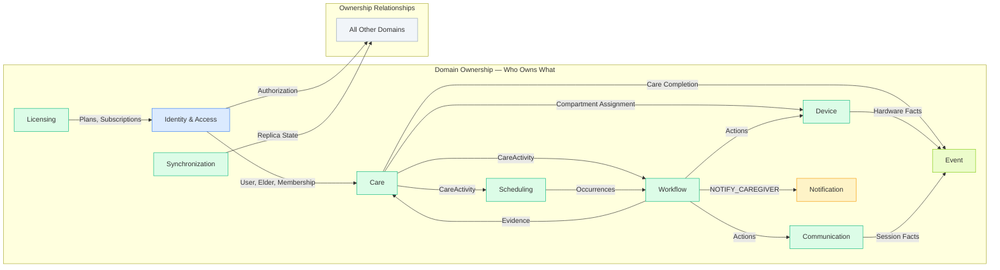
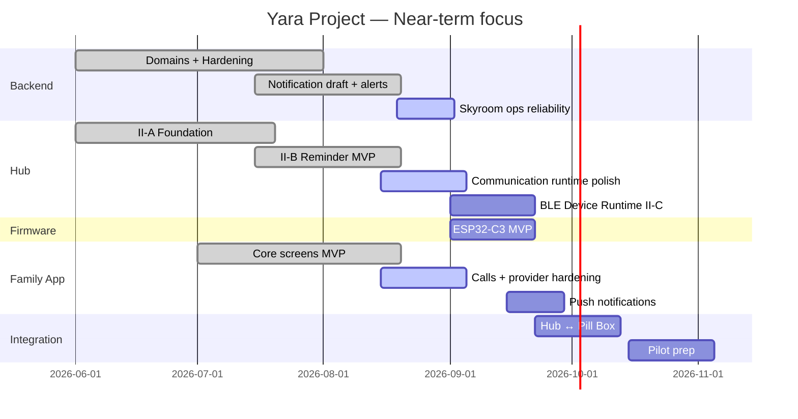

# Yara Care — تکامل پروژه (Progress Flow)

**Version:** 1.1  
**Updated:** 25 Aug 2026

منبع وضعیت: کد فعلی (`apps/hub`, `apps/family`, `backend`)، ADR-012 / ADR-015، `docs/ROADMAP.md`، و لاگ‌های integration. درصدها تخمینی‌اند و برای هم‌راستایی تیم‌اند، نه معیار رسمی Done.

---

## 0. Snapshot (الان)

| لایه | وضعیت | یادداشت |
|------|--------|---------|
| Backend domains | ✅ تقریباً کامل | 11 دامنه پیاده‌سازی‌شده؛ Notification هنوز Draft؛ Hardening انجام شده |
| Hub Sprint II-A / II-B | 🟡 ~75–80% | Reminder MVP slice (ADR-012)؛ BLE و Device Owner هنوز نیست |
| Firmware | 📋 0% | درخت firmware در ریپو وجود ندارد |
| Hub ↔ Pill Box | 📋 0% | وابسته به Firmware + BLE Runtime |
| Family (Caregiver) App | 🟡 ~70% | Auth، Dashboard، Program، Devices، Alerts، Settings فعال؛ Push هنوز نه |
| Pilot | 📋 | بعد از یکپارچگی سخت‌افزار و پایداری |

**تناقض مهم با ROADMAP:** ترتیب رسمی Sprintها خطی است، ولی در عمل Family App جلوتر از Firmware شروع شده. این flowchart واقعیت موازی را نشان می‌دهد؛ وابستگی‌های معماری (مثلاً Pill Box قبل از تأیید سخت‌افزاری) همچنان برقرارند.

---

## 1. High-Level Journey



---

## 2. Layer-by-Layer Progress

```mermaid
flowchart LR
    subgraph Stack["Yara Stack — Completion Matrix"]
        direction TB
        subgraph Firmware["Firmware"]
            F1["ESP32-C3 BLE"]
            F2["Reed Switch Detection"]
            F3["Battery Monitoring"]
            F4["Power Optimization"]
            F5["Pairing Process"]
        end

        subgraph Hub["Android Hub"]
            H1["Kiosk / Device Owner"]
            H2["Room Database (v5)"]
            H3["Sync Infrastructure"]
            H4["Offline Reminders MVP"]
            H5["BLE / Device Runtime"]
            H6["Communication Runtime"]
            H7["Runtime Kernel"]
            H8["Boot Recovery"]
        end

        subgraph Backend["Backend (Django)"]
            B1["Identity & Access"]
            B2["Licensing"]
            B3["Scheduling"]
            B4["Workflow"]
            B5["Care"]
            B6["Device"]
            B7["Communication"]
            B8["Notification draft"]
            B9["Synchronization"]
            B10["Event"]
            B11["Integration"]
            B12["Hardening"]
        end

        subgraph CareApp["Family App Expo"]
            C1["Authentication"]
            C2["Devices / Pairing UI"]
            C3["Dashboard"]
            C4["Program / Medication"]
            C5["Hub / Device Status"]
            C6["In-app Alerts"]
            C7["Contacts / Calls"]
            C8["Settings / Family"]
            C9["Push Notifications"]
        end
    end

    B1-->|✅| B2-->|✅| B3-->|✅| B4-->|✅| B5-->|✅| B6-->|✅| B7-->|✅| B8-->|🔧| B9-->|✅| B10-->|✅| B11-->|✅| B12-->|✅|

    H2-->|✅| H3-->|✅| H4-->|✅| H7-->|✅| H8-->|✅|
    H6-->|🔧|
    H1-->|📋|
    H5-->|📋|

    F1-->|📋| F2-->|📋| F3-->|📋| F4-->|📋| F5-->|📋|

    C1-->|✅| C2-->|🔧| C3-->|✅| C4-->|✅| C5-->|✅| C6-->|✅| C7-->|🔧| C8-->|✅| C9-->|📋|

    style B1 fill:#10b981,color:white
    style B2 fill:#10b981,color:white
    style B3 fill:#10b981,color:white
    style B4 fill:#10b981,color:white
    style B5 fill:#10b981,color:white
    style B6 fill:#10b981,color:white
    style B7 fill:#10b981,color:white
    style B8 fill:#f59e0b,color:white
    style B9 fill:#10b981,color:white
    style B10 fill:#10b981,color:white
    style B11 fill:#10b981,color:white
    style B12 fill:#10b981,color:white

    style H1 fill:#3b82f6,color:white
    style H2 fill:#10b981,color:white
    style H3 fill:#10b981,color:white
    style H4 fill:#10b981,color:white
    style H5 fill:#3b82f6,color:white
    style H6 fill:#f59e0b,color:white
    style H7 fill:#10b981,color:white
    style H8 fill:#10b981,color:white

    style F1 fill:#3b82f6,color:white
    style F2 fill:#3b82f6,color:white
    style F3 fill:#3b82f6,color:white
    style F4 fill:#3b82f6,color:white
    style F5 fill:#3b82f6,color:white

    style C1 fill:#10b981,color:white
    style C2 fill:#f59e0b,color:white
    style C3 fill:#10b981,color:white
    style C4 fill:#10b981,color:white
    style C5 fill:#10b981,color:white
    style C6 fill:#10b981,color:white
    style C7 fill:#f59e0b,color:white
    style C8 fill:#10b981,color:white
    style C9 fill:#3b82f6,color:white
```

### اصلاحات نسبت به v1.0

- Family App دیگر «شروع‌نشده» نیست؛ بخش عمده Sprint 5 پیاده شده (`apps/family`).
- BLE Runtime روی Hub در حال انجام نیست — stub است و `OPEN_COMPARTMENT` صریحاً به Sprint II-C موکول شده.
- Kiosk / Device Owner در کد Hub پیدا نشد (فقط در اسناد)؛ دیگر ✅ نیست.
- Notification دامنه Draft است (ADR-015): inbox درون‌برنامه‌ای هست؛ SMS/Push هنوز نه.
- Push جدا از Alerts نشان داده شده.

---

## 3. Backend Domain Deep-Dive

```mermaid
flowchart TD
    subgraph BackendDomains["Backend — implemented domains"]
        IA["Identity & Access ✅"]
        LIC["Licensing ✅"]
        SCH["Scheduling ✅"]
        WFL["Workflow ✅"]
        CARE["Care ✅"]
        DEV["Device ✅"]
        COM["Communication ✅<br/>provider-dependent at runtime"]
        NOT["Notification 🔧<br/>Draft — in-app alerts only"]
        EVT["Event ✅"]
        SYNC["Synchronization ✅"]
        INT["Integration ✅<br/>Hub provision + sync facade"]
        HARD["Hardening ✅"]
    end

    IA --> LIC --> SCH --> WFL --> CARE --> DEV --> COM --> NOT --> EVT --> SYNC --> INT --> HARD

    style IA fill:#d1fae5,stroke:#10b981
    style LIC fill:#d1fae5,stroke:#10b981
    style SCH fill:#d1fae5,stroke:#10b981
    style WFL fill:#d1fae5,stroke:#10b981
    style CARE fill:#d1fae5,stroke:#10b981
    style DEV fill:#d1fae5,stroke:#10b981
    style COM fill:#d1fae5,stroke:#10b981
    style NOT fill:#fef3c7,stroke:#f59e0b
    style EVT fill:#d1fae5,stroke:#10b981
    style SYNC fill:#d1fae5,stroke:#10b981
    style INT fill:#d1fae5,stroke:#10b981
    style HARD fill:#d1fae5,stroke:#10b981
```



**نکته عملیاتی:** `POST /api/v1/communication/call/start/` در صورت نبود/خطای Skyroom با **502** برمی‌گردد. دامنه پیاده شده است؛ تماس واقعی به `SKYROOM_API_KEY` و سرویس خارجی وابسته است.

---

## 4. Hub Architecture & Current State (🟡 Sprint 2)



### Hub Module Breakdown (واقعی)



### Sprint 2 slice status

| Slice | Status | Evidence |
|-------|--------|----------|
| II-A Foundation & Runtime | ✅ تقریباً کامل | Multi-module, Room, sync, DI, Integration + Boot |
| II-B Reminder Runtime | ✅ MVP slice (ADR-012) | Offline SHOW_REMINDER، confirm → outbox؛ polish / escalate / postpone-upload موکول |
| II-C Device / BLE | 📋 شروع نشده | `DeferredDeviceActionHandler` → «Deferred to Sprint II-C»؛ بدون کد Bluetooth |

---

## 5. Medication Reminder Flow — Current → Target



**باقی‌مانده‌های ADR-012:** polish UI، escalate/skip روی Reminder، upload postpone، کاهش اتکا به bootstrap محلی.

---

## 6. Synchronization Pipeline — Data Flow



مسیر قدیمی `/api/v1/sync/` در کد فعلی استفاده نمی‌شود.

---

## 7. Backend Test Status



### Test breakdown by area (approx. `def test_` counts)

| Area | Tests | Status |
|------|-------|--------|
| Architecture | ~40 | ✅ |
| Workflow | ~33 | ✅ |
| Scheduling | ~30 | ✅ |
| Integration | ~30 | ✅ |
| Communication | ~28 | ✅ |
| Device | ~27 | ✅ |
| Care | ~20 | ✅ |
| Identity & Access | ~19 | ✅ |
| Synchronization | ~18 | ✅ |
| Event | ~16 | ✅ |
| Licensing | ~16 | ✅ |
| Infrastructure | ~16 | ✅ |
| Notification | ~5 | 🔧 draft slice |
| Common / root | ~5 | ✅ |

`docs/CHANGELOG.md` هنوز «236 tests» دارد — عدد قدیمی است؛ این flowchart با `pytest --collect-only` هم‌خوان است (~309).

---

## 8. Sprint Dependency Graph (واقعی + معماری)



---

## 9. Domain Ownership Matrix



---

## 10. Next Milestones (واقع‌بینانه — Aug 2026)



### اولویت‌های کوتاه‌مدت پیشنهادی

1. پایدار کردن تماس (Skyroom env + 502 handling) روی Backend / Hub / Family  
2. بستن باقی‌مانده‌های ADR-012 روی Reminder  
3. شروع Sprint 3 Firmware (مسیر بحرانی برای تأیید دارو با سخت‌افزار)  
4. BLE Runtime روی Hub بعد از پروتکل Firmware  
5. Push فقط بعد از انتخاب vendor و freeze دامنه Notification  

---

## 11. Gaps deliberately called out

| موضوع | وضعیت قبلی در v1.0 | واقعیت |
|--------|---------------------|--------|
| Caregiver App | Sprint 5 = 0% | اپ `apps/family` با صفحات اصلی فعال است |
| Hub BLE | In progress | Stub؛ بدون Bluetooth API |
| Kiosk / Device Owner | ✅ | در کد نیست |
| Notification | ✅ کامل | Draft؛ فقط inbox |
| Backend tests | 236 | ~309 collected |
| Sync path | `/api/v1/sync/` | `/api/v1/hub/sync/` + `/api/v1/synchronization/` |
| Firmware Gantt | Active Aug 2026 | هنوز شروع نشده |
| Communication | فقط planned روی clients | Runtime روی Hub و Family هست؛ وابسته به provider |
