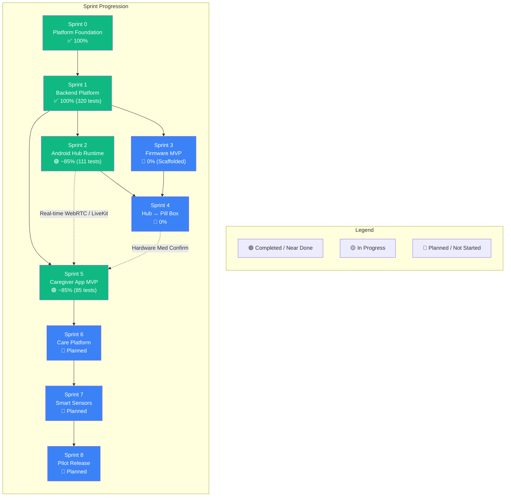
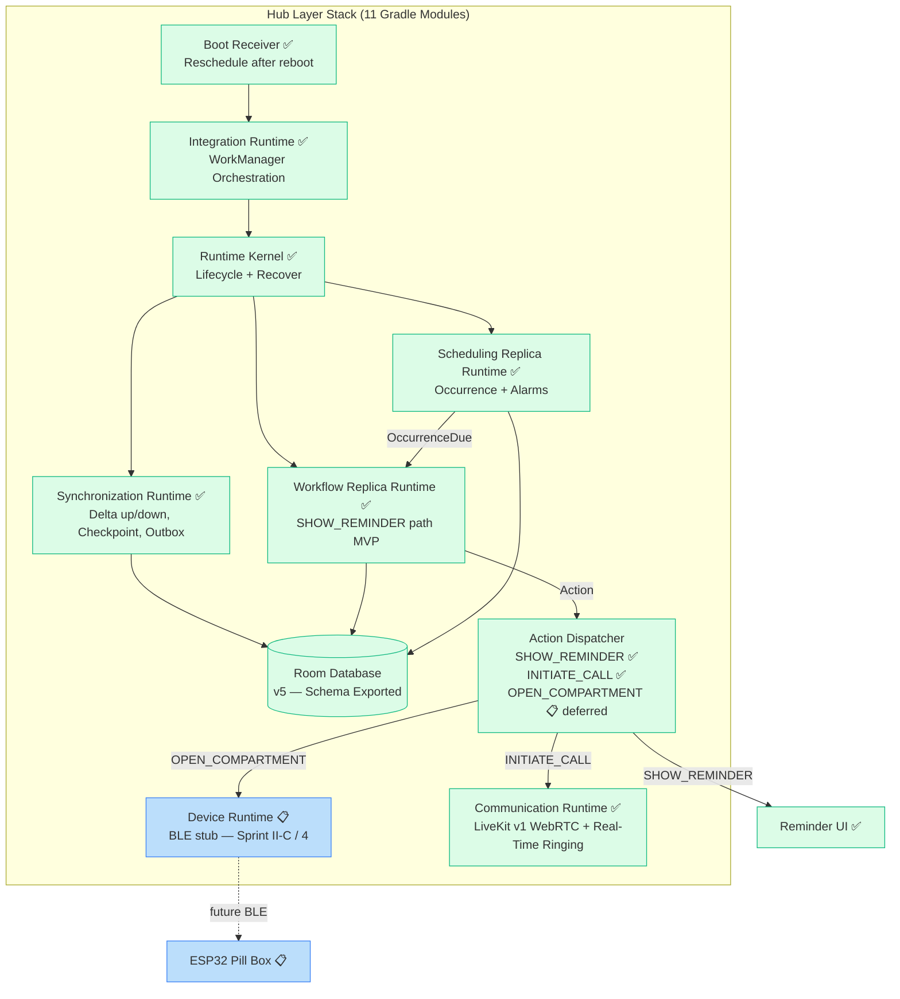
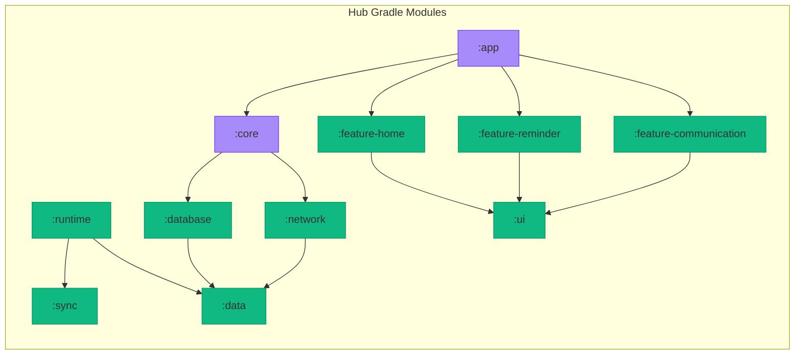
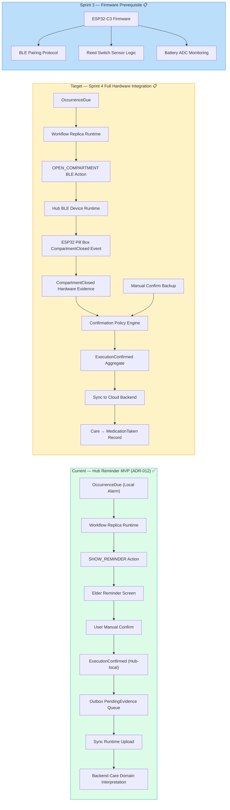
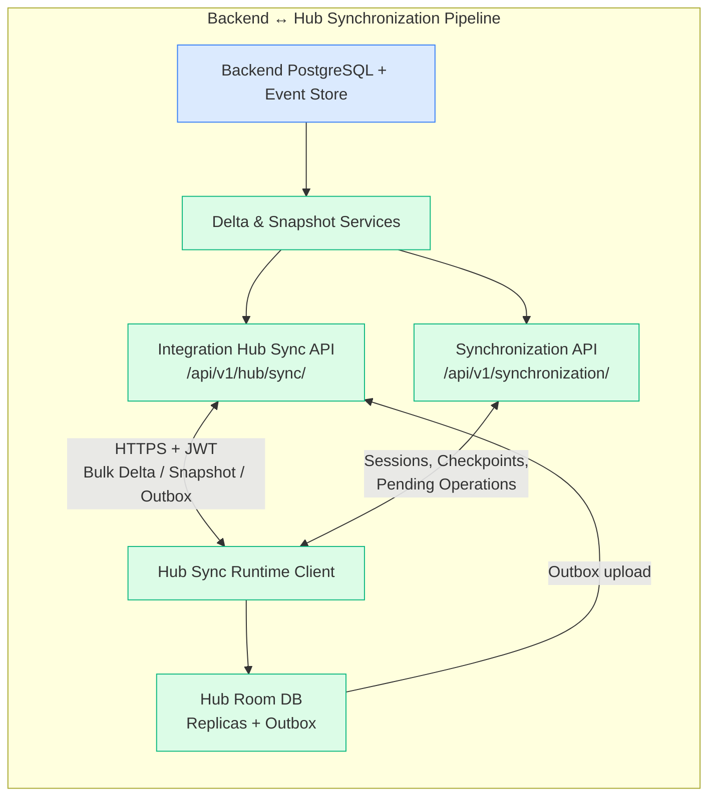
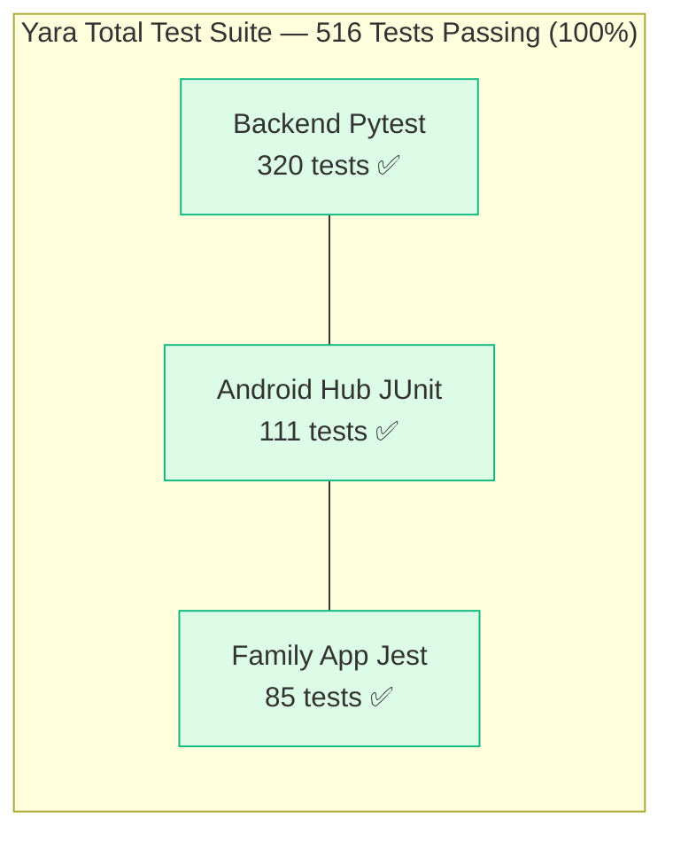
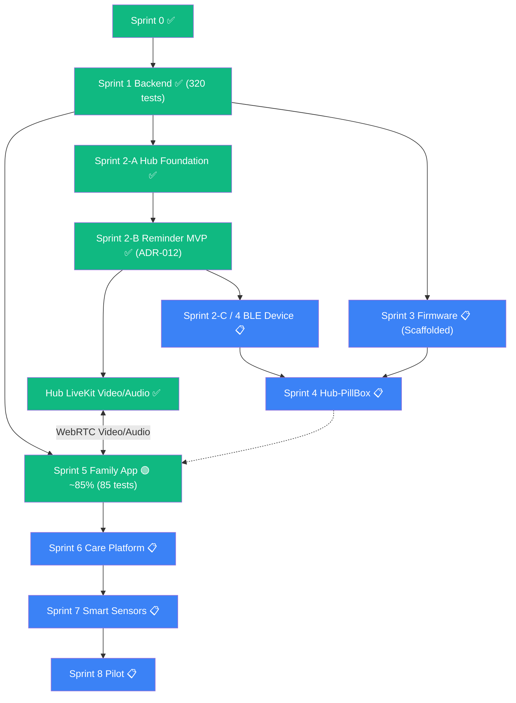
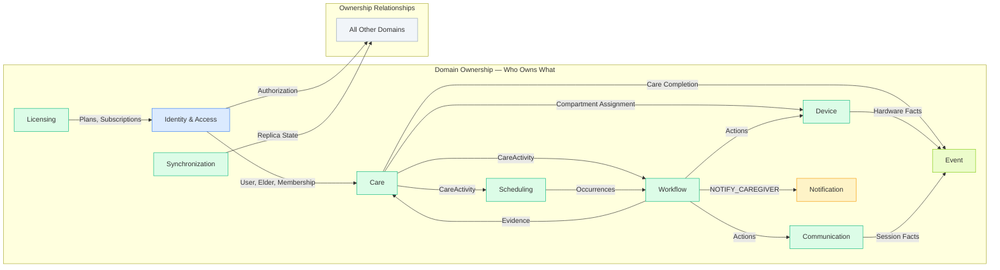

# Yara Care — تکامل پروژه (Progress Flow)

**Version:** 1.2  
**Updated:** 02 Sep 2026

منبع وضعیت: کد فعلی (`apps/hub`, `apps/family`, `backend`, `firmware`)، ADR-012 تا ADR-015، `docs/ROADMAP.md`، و نتایج اجرای تست‌ها (۳۲۰ تست بک‌اند، ۱۱۱ تست هاب، ۸۵ تست فمیلی). درصدها تخمینی‌اند و برای هم‌راستایی تیم‌اند، نه معیار رسمی Done.

---

## 0. Snapshot (الان)

| لایه | وضعیت | یادداشت |
|------|--------|---------|
| Backend domains | ✅ کامل و پایدار | ۱۰ دامنه اصلی + زیرسیستم پیام‌رسانی دوطرفه و رسانه؛ معماری ارائه‌دهنده ارتباطات LiveKit (ADR-013)؛ هشدار درون‌برنامه‌ای (ADR-015)؛ ۳۳۲ تست سبز |
| Hub Android | 🟢 ~85% | فونداسیون (Sprint II-A)، یادآور آفلاین (Sprint II-B / ADR-012)، سینک و پرویژنینگ (II-D/E)، تماس تصویری/صوتی LiveKit v1 و پیام‌رسانی دوطرفه؛ BLE موکول به فاز سخت‌افزار؛ حالت کیوسک موکول به آمادگی تولید؛ ۱۱۱ تست سبز |
| Firmware | 📋 0% | ساختار دایرکتوری‌ها (`firmware/pillbox`, `firmware/sensors`) ایجاد شده، کدنویسی در فاز سخت‌افزار آغاز می‌شود |
| Hub ↔ Pill Box | 📋 0% | وابسته به فریمور ESP32-C3 + درایور BLE در Hub (فاز یکپارچه‌سازی سخت‌افزار) |
| Family (Caregiver) App | 🟢 ~85% | احراز هویت، داشبورد مراقب، برنامه دارویی و مراقبتی، وضعیت دستگاه‌ها، هشدارهای درون‌برنامه‌ای (ADR-015)، تماس تصویری/صوتی LiveKit Native WebRTC و پیام‌رسانی دوطرفه فعال؛ ۸۵ تست سبز |
| Pilot | 📋 | پس از تکمیل فازهای نرم‌افزاری (پلن/پرداخت، رادیو، پوش)، فریمور، اتصال سخت‌افزار و پایداری نهایی |

**تطبیق با نقشه راه محصول:** تماس ویدیویی/صوتی و پیام‌رسانی دوطرفه به عنوان بخشی از MVP پیاده‌سازی شده‌اند. کار نرم‌افزاری باقیمانده شامل فاز ۲ (پلن‌ها و پرداخت)، فاز ۳ (رادیو) و فاز ۴ (پوش‌نوتیفیکیشن) است و پس از آن یکپارچه‌سازی سخت‌افزاری و سپس آمادگی تولید (حالت کیوسک) انجام خواهد شد.

---

## 1. High-Level Journey



---

## 2. Layer-by-Layer Progress

```mermaid
flowchart LR
    subgraph Stack["Yara Stack — Completion Matrix"]
        direction TB
        
        subgraph Firmware["Firmware (ESP32-C3)"]
            direction LR
            F1["BLE Service 📋"]
            F2["Reed Switch Detection 📋"]
            F3["Battery Monitoring 📋"]
            F4["Power Optimization 📋"]
            F5["Pairing Process 📋"]
            F1 --- F2 --- F3 --- F4 --- F5
        end

        subgraph Hub["Android Hub (11 Modules)"]
            direction LR
            H1["Kiosk / Device Owner 📋"]
            H2["Room Database v5 ✅"]
            H3["Sync Infrastructure ✅"]
            H4["Offline Reminders MVP ✅"]
            H5["BLE / Device Runtime 📋"]
            H6["Communication LiveKit ✅"]
            H7["Runtime Kernel ✅"]
            H8["Boot Recovery ✅"]
            H2 --- H3 --- H4 --- H6 --- H7 --- H8
        end

        subgraph Backend["Backend Django (11 Domains)"]
            direction LR
            B1["Identity & Access ✅"]
            B2["Licensing ✅"]
            B3["Scheduling ✅"]
            B4["Workflow ✅"]
            B5["Care ✅"]
            B6["Device ✅"]
            B7["Communication (LiveKit/Skyroom) ✅"]
            B8["Notification (In-app Inbox) 🔧"]
            B9["Synchronization ✅"]
            B10["Event ✅"]
            B11["Integration ✅"]
            B12["Hardening ✅"]
            B1 --> B2 --> B3 --> B4 --> B5 --> B6 --> B7 --> B8 --> B9 --> B10 --> B11 --> B12
        end

        subgraph CareApp["Family App Expo (React Native)"]
            direction LR
            C1["Authentication ✅"]
            C2["Devices / Pairing UI ✅"]
            C3["Dashboard ✅"]
            C4["Program / Medication ✅"]
            C5["Hub / Device Status ✅"]
            C6["In-app Alerts (ADR-015) ✅"]
            C7["LiveKit Video & Audio Calls ✅"]
            C8["Settings / Family ✅"]
            C9["Push Notifications (FCM) 📋"]
            C1 --> C3 --> C4 --> C5 --> C6 --> C7 --> C8
        end
    end

    style B1 fill:#10b981,color:white
    style B2 fill:#10b981,color:white
    style B3 fill:#10b981,color:white
    style B4 fill:#10b981,color:white
    style B5 fill:#10b981,color:white
    style B6 fill:#10b981,color:white
    style B7 fill:#10b981,color:white
    style B8 fill:#f59e0b,color:white
    style B9 fill:#10b981,color:white
    style B10 fill:#10b981,color:white
    style B11 fill:#10b981,color:white
    style B12 fill:#10b981,color:white

    style H1 fill:#3b82f6,color:white
    style H2 fill:#10b981,color:white
    style H3 fill:#10b981,color:white
    style H4 fill:#10b981,color:white
    style H5 fill:#3b82f6,color:white
    style H6 fill:#10b981,color:white
    style H7 fill:#10b981,color:white
    style H8 fill:#10b981,color:white

    style F1 fill:#3b82f6,color:white
    style F2 fill:#3b82f6,color:white
    style F3 fill:#3b82f6,color:white
    style F4 fill:#3b82f6,color:white
    style F5 fill:#3b82f6,color:white

    style C1 fill:#10b981,color:white
    style C2 fill:#10b981,color:white
    style C3 fill:#10b981,color:white
    style C4 fill:#10b981,color:white
    style C5 fill:#10b981,color:white
    style C6 fill:#10b981,color:white
    style C7 fill:#10b981,color:white
    style C8 fill:#10b981,color:white
    style C9 fill:#3b82f6,color:white
```



### تغییرات و ارتقاهای کلیدی
- **مهاجرت ارتباطات به LiveKit v1:** پیاده‌سازی ارائه‌دهنده LiveKit در بک‌اند (ADR-013)، صدور توکن‌های امن JWT، پیاده‌سازی WebRTC نیتیو در Family App (`@livekit/react-native`) و ران‌تایم اختصاصی LivekitCallEngine به همراه صفحه تماس و زنگ ریل‌تایم روی Hub.
- **پیام‌رسانی دوطرفه کامل (Two-Way Messaging):** پیاده‌سازی کامل ارسال و دریافت پیام‌های متنی، پیام صوتی (Voice Message)، عکس و ویدیو در بک‌اند (`Message`, `MessageAttachment`)، هاب (`MessagingRepositoryImpl`) و اپلیکیشن فمیلی با وضعیت‌های تحویل و خوانده‌شدن.
- **تست‌ها و ثبات:** ۳۳۲ تست بک‌اند (۱۰۰٪ پاس)، ۱۱۱ تست هاب (۱۰۰٪ پاس)، ۸۵ تست فمیلی اپ (۱۰۰٪ پاس).
- **جداسازی معماری تماس از پیام صوتی:** تماس صوتی/تصویری هم‌زمان (Synchronous LiveKit Call) از پیام صوتی ناهمگام (Asynchronous Voice Message) کاملاً در داده‌ها و ماشین وضعیت جداست (`Voice Message != Voice Call`).
- **وضعیت فریمور و کیوسک:** فریمور در انتظار فاز یکپارچه‌سازی سخت‌افزار است؛ حالت کیوسک هاب به فاز آمادگی تولید موکول شده است.

---

## 3. Backend Domain Deep-Dive

```mermaid
flowchart TD
    subgraph BackendDomains["Backend — 11 Implemented Domains (320 tests)"]
        IA["Identity & Access ✅"]
        LIC["Licensing ✅"]
        SCH["Scheduling ✅"]
        WFL["Workflow ✅"]
        CARE["Care ✅"]
        DEV["Device ✅"]
        COM["Communication ✅<br/>LiveKit v1 Primary + Skyroom Fallback (ADR-013)"]
        NOT["Notification 🔧<br/>Draft — In-App Alert Inbox (ADR-015)"]
        EVT["Event ✅"]
        SYNC["Synchronization ✅"]
        INT["Integration ✅<br/>Hub Provisioning + Sync Facade + Alert Handlers"]
        HARD["Hardening ✅"]
    end

    IA --> LIC --> SCH --> WFL --> CARE --> DEV --> COM --> NOT --> EVT --> SYNC --> INT --> HARD

    style IA fill:#d1fae5,stroke:#10b981
    style LIC fill:#d1fae5,stroke:#10b981
    style SCH fill:#d1fae5,stroke:#10b981
    style WFL fill:#d1fae5,stroke:#10b981
    style CARE fill:#d1fae5,stroke:#10b981
    style DEV fill:#d1fae5,stroke:#10b981
    style COM fill:#d1fae5,stroke:#10b981
    style NOT fill:#fef3c7,stroke:#f59e0b
    style EVT fill:#d1fae5,stroke:#10b981
    style SYNC fill:#d1fae5,stroke:#10b981
    style INT fill:#d1fae5,stroke:#10b981
    style HARD fill:#d1fae5,stroke:#10b981
```



**نکته زیرساختی ارتباطات (ADR-013):**  
بک‌اند ارائه‌دهنده را انتزاعی کرده است (`CommunicationProvider`). در حال حاضر `LivekitCommunicationProvider` به عنوان ارائه‌دهنده پیش‌فرض توکن‌های امن JWT صادر می‌کند و اتاق‌های پایدار بر اساس شناسه سالمند مدیریت می‌شوند؛ نیازی به وابستگی مستقیم کلاینت‌ها به APIهای شرکت واسط نیست.

---

## 4. Hub Architecture & Current State (Sprint 2 + LiveKit)



### Hub Module Breakdown (واقعی — ۱۱ ماژول گرادل)



### وضعیت برش‌های Sprint 2 و ارتباطات

| Slice | وضعیت | مستندات و شواهد |
|-------|--------|-----------------|
| II-A Foundation & Runtime | ✅ کامل | معماری ۱۱ ماژوله، Room v5، تزریق وابستگی Hilt، Integration + Boot Recovery |
| II-B Reminder Runtime | ✅ MVP کامل (ADR-012) | اجرای آفلاین `SHOW_REMINDER`، تعویق محلی (Postpone)، ثبت Evidence در Outbox، ارسال به بک‌اند |
| II-D / II-E Sync & Provisioning | ✅ کامل | سینک دلتای افزایشی، سیستم Staging دانلود، گیت احراز هویت و Provisioning |
| Communication LiveKit Runtime | ✅ کامل | موتور تماس LiveKit v1، مدیریت تماس دریافتی/ارسالی، رابط کاربری سالمند-محور `CallScreen` و `TalkingScreen` |
| II-C Device / BLE | 📋 شروع‌نشده | هندلر `DeferredDeviceActionHandler` به عنوان Stub؛ بدون کد Bluetooth |
| Kiosk / Device Owner | 📋 در برنامه | در معماری تعیین شده، اما هنوز در کد اندروید فعال نشده است |

---

## 5. Medication Reminder Flow — وضعیت فعلی و هدف



---

## 6. Synchronization Pipeline — Data Flow



---

## 7. Test Matrix & Code Health



### تفکیک تست‌های بک‌اند (۳۲۰ تست در ۱۱ دامنه و معماری)

| دامنه / حوزه | تعداد تست‌ها | وضعیت | تمرکز تست‌ها |
|---|---|---|---|
| Architecture Contracts | ۴۰ | ✅ | تست‌های عدم وجود Foreign Key نامجاز و جداسازی وابستگی‌ها |
| Workflow | ۳۳ | ✅ | ماشین وضعیت، اجرای آفلاین، سیاست‌های تعویق و عدم مصرف |
| Integration | ۳۰ | ✅ | پرویژنینگ هاب، احراز هویت، سناریوهای E2E و نگاشت Alert |
| Scheduling | ۳۰ | ✅ | تعریف زمان‌بندی، تولید رخداد و قوانین تقویمی |
| Communication | ۲۸ | ✅ | نشست تماس، مدیریت شرکت‌کنندگان و امنیت عدم انتشار توکن |
| Infrastructure Providers | ۲۷ | ✅ | تست‌های LiveKit Provider (۱۱ تست)، Skyroom Provider (۱۵ تست)، Fake Provider |
| Device | ۲۷ | ✅ | ثبت دستگاه، انتساب محفظه و ارسال فرمان |
| Care | ۲۰ | ✅ | برنامه‌های مراقبتی، داروها و تفسیر رویدادهای مراقبتی |
| Identity & Access | ۱۹ | ✅ | احراز هویت، مدیریت سالمند، عضویت مراقبان و کنترل دسترسی |
| Synchronization | ۱۸ | ✅ | نشست سینک، ایجاد چک‌پوینت و عملیات دسته‌ای |
| Event Store | ۱۶ | ✅ | ثبات رویدادهای دامنه و ردگیری تغییرات |
| Licensing | ۱۶ | ✅ | پلن‌ها، اشتراک‌ها و محدودیت‌های دسترسی |
| Notification (Draft) | ۵ | 🔧 | صندوق هشدارهای درون‌برنامه‌ای و مدیریت Alertها |
| Common & Root Health | ۵ | ✅ | پاسخ‌های استاندارد خطا و سلامت کلی سرویس |
| **مجموع تست‌های بک‌اند** | **۳۲۰** | **✅ ۱۰۰٪** | **بدون هیچ‌گونه تست ناموفق** |

---

## 8. Sprint Dependency Graph (واقعی + معماری)



---

## 9. Domain Ownership Matrix



---

## 10. Next Milestones (برنامه عملیاتی و واقع‌بینانه — سپتامبر ۲۰۲۶)

```mermaid
gantt
    title Yara Project — برنامه کوتاه‌مدت و مسیر بحرانی
    dateFormat  YYYY-MM-DD
    section Backend
    Domains + Hardening + LiveKit      :done,    be1, 2026-06-01, 2026-08-28
    Notification Draft Inbox (ADR-015) :done,    be2, 2026-08-01, 2026-08-30
    Phase 2: Licensing + Plans + Billing :active, be3, 2026-09-05, 14d
    section Hub
    II-A Foundation + Room v5          :done,    h1,  2026-06-01, 2026-07-20
    II-B Reminder MVP (ADR-012)        :done,    h2,  2026-07-15, 2026-08-20
    LiveKit Video Call + Ringing       :done,    h3,  2026-08-20, 2026-09-02
    Two-Way Messaging Subsystem        :done,    h4,  2026-09-01, 2026-09-05
    Phase 3: Radio on Elder Hub        :         h5,  2026-09-20, 10d
    section Family App
    Core screens + Care Management     :done,    fa1, 2026-07-01, 2026-08-20
    LiveKit Native Video / Audio Calls :done,    fa2, 2026-08-20, 2026-09-02
    Two-Way Messaging Screen           :done,    fa3, 2026-09-01, 2026-09-05
    Phase 4: Push Notifications        :         fa4, 2026-09-25, 14d
    section Hardware Integration
    ESP32-C3 Firmware (Smart Pill Box) :crit,    hw1, 2026-10-05, 21d
    Hub BLE Driver (Sprint II-C/4)     :crit,    hw2, 2026-10-15, 21d
    Smart Wearable Integration         :         hw3, 2026-11-01, 14d
    section Production Readiness
    Hub Kiosk / LockTask Mode          :         pr1, 2026-11-15, 10d
    Pilot Candidate Ready              :         pr2, 2026-11-25, 14d
```

### اولویت‌های کلیدی جاری (ترتیب نرم‌افزاری و سخت‌افزاری)
1. **فاز ۲ نرم‌افزاری — پلن‌ها، اشتراک و درگاه پرداخت (Licensing & Billing):** تکمیل مدل `Subscription`، ماژول صدور فاکتور و اتصال به درگاه پرداخت در لایه Infrastructure.
2. **فاز ۳ نرم‌افزاری — رادیو در هاب سالمند (Radio inside Elder Hub):** افزودن پخش‌کننده استریم صوتی سبک و رابط کاربری آرامش‌بخش رادیو روی صفحه خانگی هاب.
3. **فاز ۴ نرم‌افزاری — پوش نوتیفیکیشن (Push Notifications - FCM/APNs):** پیاده‌سازی ارائه‌دهنده پوش برای زنگ تماس و هشدارهای فوری در پس‌زمینه.
4. **فاز یکپارچه‌سازی سخت‌افزار (Hardware Integration):**
   - توسعه فریمور جعبه داروی هوشمند (ESP32-C3) با سنسور رید سوئیچ و مانیتورینگ باتری.
   - پیاده‌سازی درایور کلاینت BLE در هاب (جایگزینی `DeferredDeviceActionHandler`).
   - یکپارچه‌سازی دستبند هوشمند (Smart Wearable) برای هشدار سقوط و دکمه اضطراری SOS.
5. **فاز آمادگی تولید (Production Readiness):** فعال‌سازی حالت کیوسک هاب (LockTask / Device Owner)، آزمون پایداری سراسری E2E، و تست پرواز پایلوت.

---

## 11. جدول تطبیق واقعیت‌های فنی پروژه

| موضوع | وضعیت در گزارش قبلی (v1.1) | واقعیت فعلی و به‌روزرسانی (v1.2) |
|---|---|---|
| تماس تصویری / صوتی | 🔧 وابسته به Skyroom با خطای ۵۰۲ | 🟢 مهاجرت کامل به LiveKit v1 (ADR-013)؛ WebRTC نیتیو در Family App و هاب با زنگ ریل‌تایم |
| پیام‌رسانی دوطرفه و پیام صوتی | نامشخص / غیرفعال با پیام موقت | 🟢 پیاده‌سازی کامل پیام‌رسانی دوطرفه (متن، پیام صوتی، عکس، ویدیو) با وضعیت تحویل/خوانده در بک‌اند، هاب و فمیلی اپ |
| تعداد تست‌های بک‌اند | ۳۰۹ مورد تقریبی | ✅ ۳۳۲ تست رسمی با pytest (۱۰۰٪ پاس) در ۱۱ دامنه، معماری و زیرساخت |
| تست‌های Family App | نامشخص در گزارش قبلی | ✅ ۸۵ تست Jest در ۱۳ مجموعه آزمون (۱۰۰٪ پاس) |
| تست‌های Android Hub | نامشخص در گزارش قبلی | ✅ ۱۱۱ تست یونیت ماژولار (۱۰۰٪ پاس) در ۱۱ ماژول گرادل |
| فریمور سخت‌افزار | درخت فریمور وجود ندارد | 📋 ساختار دایرکتوری ایجاد شده، کدنویسی در فاز سخت‌افزار آغاز می‌شود |
| حالت کیوسک هاب (Kiosk) | به عنوان پیش‌نیاز MVP فرض می‌شد | ⏸️ موکول به فاز آمادگی تولید (Production Readiness) جهت تسریع تست و دیباگ |
| هشدارهای مراقب | فقط در سطح تئوری | 🔧 فعال در سطح صندوق هشدارهای درون‌برنامه‌ای (ADR-015) متصل به Workflow و Care |
| سینک هاب | مسیر قدیمی `/api/v1/sync/` | ✅ خط لوله دوگانه `/api/v1/hub/sync/` (نما) و `/api/v1/synchronization/` (چک‌پوینت) |
